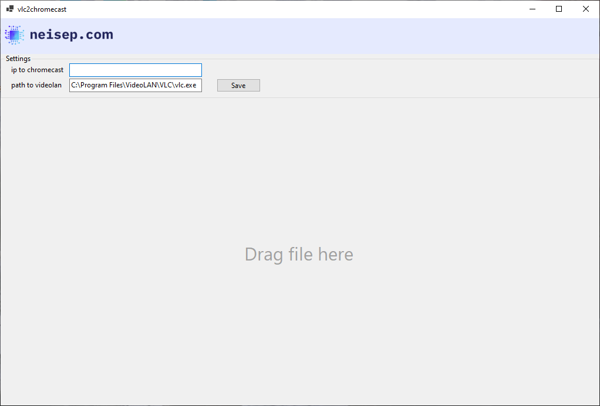

# 📺 vlc2chromecast

A simple **C# application** to stream videos from **VLC Media Player** directly to a **Chromecast** device.  
It acts as a bridge between VLC and Chromecast, making it easy to cast local media files.

---

## ✨ Features
- Stream local videos from VLC to Chromecast
- Lightweight Windows application
- Built with C# / .NET
- No complicated setup required

---

## 📦 Installation
1. Download exe from release section
---

## 🛠 Usage
1. Ensure your Chromecast is on the same network as your computer.
2. Launch **vlc2chromecast.exe**.
3. Select the video file you want to play.
4. The video will start streaming on your Chromecast via VLC.

---

## 📸 Screenshot

---

## ⚙️ Requirements
- Windows OS
- VLC Media Player installed
- Chromecast device on the same network
- .NET Framework (or .NET runtime as required by the project)

---

## 🤝 Contributing
Contributions are welcome:
- Fork the repo
- Create a branch for your changes
- Submit a pull request

---

## 📄 License
Licensed under **GPL-3.0**. See the LICENSE file for details.

---

## 📬 Contact
Created by [neisep](https://github.com/neisep).  
Open an issue for suggestions or improvements.
